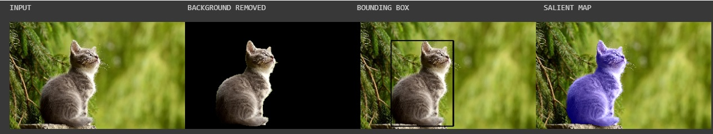
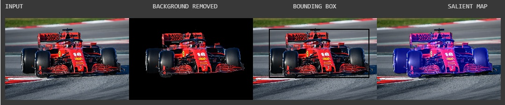
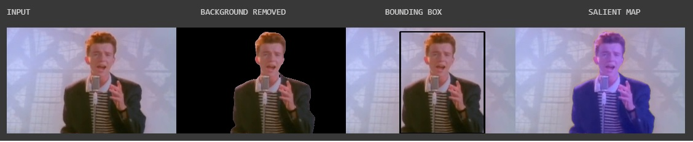

# U-2-Net-Demo
Demonstration using Google Colab to show how U-2-NET can be used for Background Removal, Bounding Box Creation and Salient Feature Highlighting

# Link: [Open Google Colab Notebook](https://colab.research.google.com/github/shreyas-bk/U-2-Net-Demo/blob/master/DEMOS/U_2_Netp_Demonstration_Colab.ipynb)

**Click this link for step-by-sep instructions:** [Open Google Colab Notebook](https://colab.research.google.com/github/shreyas-bk/U-2-Net-Demo/blob/master/DEMOS/U_2_Netp_Step_by_Step_Demonstration_Colab.ipynb) {Use this to save your results too}

# Example Results

Cat:

Formula 1 Car:

Rick Astley:

# Useful material

**U-2-NET Paper:** [U2-Net: Going Deeper with Nested U-Structure for Salient Object Detection](https://arxiv.org/abs/2005.09007)

**Original Repo:** [U-2-Net Github repo](https://github.com/NathanUA/U-2-Net)

**Modified repo for that this colab uses:** [Modified fork](https://github.com/shreyas-bk/U-2-Net)

**References:** X. Qin, Z. Zhang, C. Huang, M. Dehghan, O. R. Zaiane, and M. Jagersand, “U2-net: Going deeper with nested u-structure for salient object
detection,” Pattern Recognition, vol. 106, p. 107404, 2020

# Other Results

# Details about U-2-Net
The following is an excerpt from the paper:
*'In this paper, we design a simple yet powerful deep network architecture, U2-Net, for salient object detection (SOD). The architecture of our U2-Net is a two-level nested U-structure. The design has the following advantages: (1) it is able to capture more contextual information from different scales thanks to the mixture of receptive fields of different sizes in our proposed ReSidual U-blocks (RSU), (2) it increases the depth of the whole architecture without significantly increasing the computational cost because of the pooling operations used in these RSU blocks. This architecture enables us to train a deep network from scratch without using backbones from image classification tasks. We instantiate two models of the proposed architecture, U2-Net (176.3 MB, 30 FPS on GTX 1080Ti GPU) and U2-Net† (4.7 MB, 40 FPS), to facilitate the usage in different environments. Both models achieve competitive performance on six SOD datasets.'*

# U2NET Model

TODO:
- re-upload of image files causes ipynb.checkpoints file to be created, find a workaround for that
- support .jpeg images
- upload python code for webcam support
- add license to nbs
