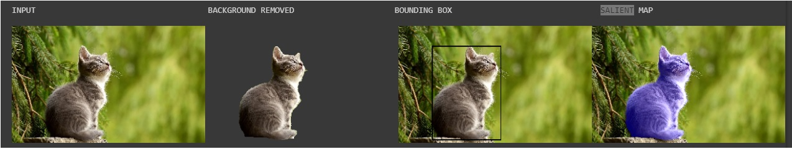
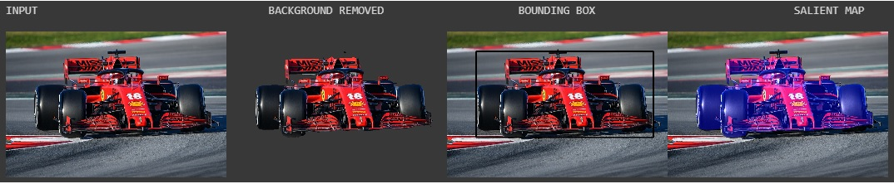
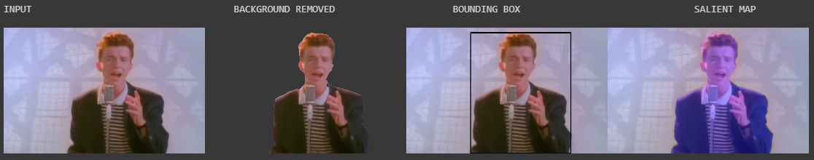

# U-2-Net-Demo
Demonstration using Google Colab to show how U-2-NET can be used for Background Removal, Changing Backgrounds, Bounding Box Creation, Salient Feature Highlighting and Salient Object Cropping

*Please let me know if you would like to collaborate on building a website/web demo for this repo*

## Check out these articles making use of this repository: 
[I REMOVED THE BACKGROUNDS FROM 11,782 JPGS FOR FREE! USING AI!](https://drivemarketing.ca/en/blog/i-removed-the-backgrounds-from-11-782-jpgs-for-free-using-ai/)

[Medium: Large Scale Background Removal Using AI](https://medium.com/@shreykera7/large-scale-background-removal-using-ai-17d245b2cdb5)

# UPDATES: upcoming update - notebook for inferencing a large number of images
 - [Jan 11, 2021] - Salient Object Cropping notebook is now available following this [PR](https://github.com/shreyas-bk/U-2-Net/pull/1), thanks to the contribution from [**Norod**](https://github.com/Norod)!
 - [Jan 05, 2021] - **Keras .h5 saved models available** in new [repository](https://github.com/shreyas-bk/U-2-Net-Keras) following this [issue](https://github.com/shreyas-bk/U-2-Net-Demo/issues/9) *Note: if there are any new requests for a TensorFlow saved model, I will upload*
 - [Dec 24, 2020] - change background in step by step file: [commit](https://github.com/shreyas-bk/U-2-Net-Demo/commit/71c0c8ba726bcfa1c97ddb513265ef9deede1df1)
 - [Oct 29, 2020] - implemented quick fix for ipynb.checkpoints error: [commit](https://github.com/shreyas-bk/U-2-Net-Demo/commit/f059e696e0ce6f6512486fbf6e9237700b710987)

# Link: [Open Google Colab Notebook](https://colab.research.google.com/github/shreyas-bk/U-2-Net-Demo/blob/master/DEMOS/U_2_Netp_Demonstration_Colab.ipynb)

**Click this link for step-by-step instructions:** [Open Google Colab Notebook](https://colab.research.google.com/github/shreyas-bk/U-2-Net-Demo/blob/master/DEMOS/U_2_Netp_Step_by_Step_Demonstration_Colab_v2.ipynb) {Use this to save your results too} {update: now with code to change background}

**Click this link for Salient Object Cropping:** [U_2_Netp_Cropper_Colab](https://colab.research.google.com/github/shreyas-bk/U-2-Net-Demo/blob/master/DEMOS/U_2_Netp_Cropper_Colab.ipynb)

# Example Results

Cat:

Formula 1 Car:

Rick Astley:

Background Changed:

Bacground Removed and Image Cropped (Mask and Resulting Image):

              

# Useful material

**U-2-NET Paper:** [U2-Net: Going Deeper with Nested U-Structure for Salient Object Detection](https://arxiv.org/abs/2005.09007)

**Original Repo:** [U-2-Net Github repo](https://github.com/NathanUA/U-2-Net)

**Modified repo for that this colab uses:** [Modified fork](https://github.com/shreyas-bk/U-2-Net)

**References:** X. Qin, Z. Zhang, C. Huang, M. Dehghan, O. R. Zaiane, and M. Jagersand, “U2-net: Going deeper with nested u-structure for salient object
detection,” Pattern Recognition, vol. 106, p. 107404, 2020

# Other Results

# Details about U-2-Net
The following is an excerpt from the paper:
*'In this paper, we design a simple yet powerful deep network architecture, U2-Net, for salient object detection (SOD). The architecture of our U2-Net is a two-level nested U-structure. The design has the following advantages: (1) it is able to capture more contextual information from different scales thanks to the mixture of receptive fields of different sizes in our proposed ReSidual U-blocks (RSU), (2) it increases the depth of the whole architecture without significantly increasing the computational cost because of the pooling operations used in these RSU blocks. This architecture enables us to train a deep network from scratch without using backbones from image classification tasks. We instantiate two models of the proposed architecture, U2-Net (176.3 MB, 30 FPS on GTX 1080Ti GPU) and U2-Net† (4.7 MB, 40 FPS), to facilitate the usage in different environments. Both models achieve competitive performance on six SOD datasets.'*

# U2NET Model

TODO:
- remove dependancy to secondary repo
- algorithmic post processing
- flask demo
- multiproc cpu code
- benchmarks
- video background removal
- change backgrounds for main notebook
- support .jpeg images
- upload python code for webcam support
- add demo for portrait feature of U-2-Net
- add license to nbs
- maybe make a webpage for bounding box creation over large datasets

**Please feel free to suggest changes to improve this repository**
